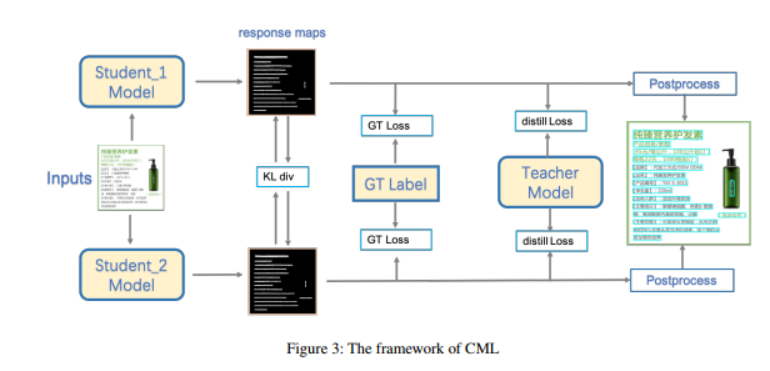

- link: [[PP-OCR2]]
- 
- 본 프레임워크는 여러 개의 student와 teacher 모델로 이뤄지며, distillation 이후 stduent model은 teacher model의 정확도를 뛰어 넘을 수 있음
- CML은
	- teacher 모델은 2개의 student model의 학습을 가이드 함
		- backbone: ResNet18
		- freezed
	- 2개의 student model이 DML 방법을 이용해 서로로부터 학습함
		- backbone: MobilenetV3 with scale .5
		- unfreezed
- 3개의 Loss
	- GT loss $$L_{gt}$$
		- true label을 이용해 supervised learning
		- DBNet 이용하므로, probability map loss와 binary map loss의 결합
		- $$Loss_{gt}(T_{out},gt)=l_p(S_{out},gt)+{\alpha}l_b(S_{out},gt)+{\beta}l_t(S_{out},gt)$$
			- .$$l_p$$: probability map loss (Binary Cross Entropy Loss)
			- .$$l_b$$: binary map loss (Dice Loss)
			- .$$l_t$$: threshold map loss (L1 loss)
			-
	- peer loss from student model $$L_s$$
		- $$Loss_{dml}=\frac{{KL(S1_{pout}||S2_{pout})+KL(S2_{pout}||S1_{pout})}}{2}$$
	- distill loss from teacher model $$L_t$$
		- sub-student 모델에 대한 teacher model의 감독(supervision)을 반영
		- teacher model이 성능향상에 중요한 a wealth of knowledge를 student models에 제공
		- $$Loss_{distill}={\gamma}l_p(S_{out},f_{dila}(T_{out}))+l_b(S_{out},f_{dila}(T_{out}))$$
	- 최종 loss function $$Loss_{total}=Loss_{gt}+Loss_{dml}+Loss_{distill}$$
-
	-
-