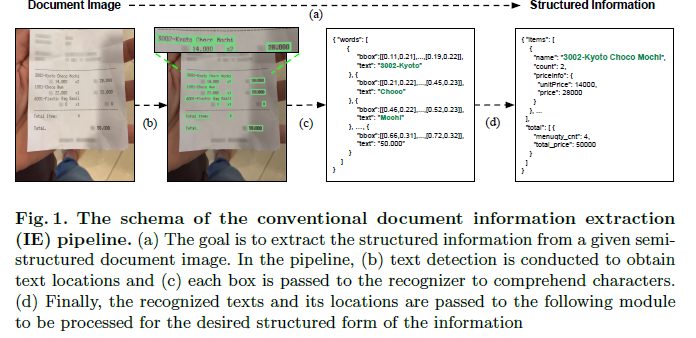
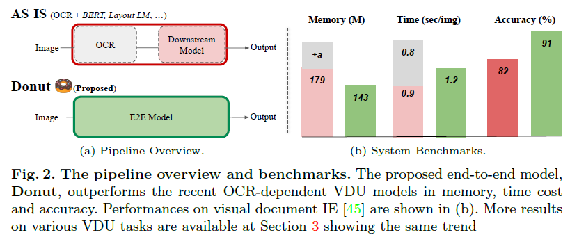
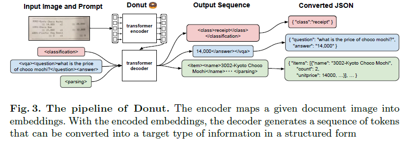

- Paper
	- 저자: Kim
	- 날짜:
	- 상태: On
	- 주소: [논문](https://arxiv.org/abs/2111.15664), [코드](https://github.com/clovaai/donut)
	-
	- ## 데이터 샘플 [링크](https://github.com/clovaai/donut#data)
		- #### For Document Information Extraction
			- https://huggingface.co/datasets/naver-clova-ix/cord-v2
		-
	-
	- ## Introduction
		- `donut`  interprets all tasks as a JSON prediction problem.
		- Understanding document images (e.g., invoices) is a core but challenging task since it requires complex functions such as reading text and a holistic understanding of the document.
		- VDU는 document classification, information extraction, visual question anwering등의 응용 분야에 적용 가능
		- 일반적은 VDU 방법은 two-stage manner로 나눠 푼다.
			- 1) 문서 이미지에서 글자 읽기
			- 2) 문서를 깜짝 놀랄 정도로 이해하기
			- 대부분 딥러닝 기반의 OCR에 의존해 1)를 해결
			- 
		- OCR 기반의 visual document understanding의 경우 다음과 같은 문제를 겪는다
			- OCR를 사용하는데 있어 높은 computational cost
			- 문서 종류나 언어에 대한 inflexibility => poor generalization ability
			- OCR error가 연속해서 퍼져 나감 (OCR error propagation to the sub-sequent process)
		- OCR dependency로 발생하는 문제 해결을 위해 OCR-free VDU model 제안
		- Pre-train-and-fine-tune scheme을 따름
			- pre-training phase: 이미지와 이전 텍스트 문맥에 대한 조건부 확률로 다음 단어를 예측함으로써 **how to read the texts**
			- fine-tune phase: Downstream task에 맞게 **how to understand the whole document**
			- 
		-
	- ## Related Works
		-
	- ## Methodologies
		- ### Preliminary: background
			- 
			- OCR과 BERT의 비약적인 발전으로, 여러 OCR-dependent VUD모델들은 그 둘을 합쳤으며,
			- 최근의 general VDU는 개쩌는 OCR 엔진과 large-scale real document image data (IIT-CDIP)를 이용해 model pretrain을 수행한다. 눈에 띄는 진보를 이뤘지만 전체적인 VDU의 성능을 ensure하기 위해선 최신의 OCR 엔진을 이용하는 노력이 필요하다
		- ### Document Understanding Transformer
			- Donut은 Transformer 기반의 visual encoder와 textual decoder module로 이뤄짐
			- OCR 기능이 있는 모듈에 의존하지 않고 주어진 문서 이미지에서 특징을 추출하는 visual encoder를 이용
			- Textual decoder는 추출된 feature를 일련의 subword token에 매핑해 원하는 형태의 구조적 포맷을 형성. (Json과 같은)
			- 각 모델 요소는 Transformer-based여서 end-to-end로 학습 됨
		- ### Encoder
			- 입력 이미지 $$x \in \mathbb{R}^{H \times W \times C}$$ 를 임베딩 셋 $$\{ \mathbf{z}_i|\mathbf{z}_i \in \mathbb{R}^d , 1\le i\le n \}$$으로 바꿈, $$n$$은 특징 맵 크기 이거나 이미지 패치의 수이며 $$d$$는 encoder의 latent vector 차원
			- Encoder 네트워크는 CNN이나 Transformer가 될 수 있음 (비교 실험 수행)
				- 논문에서는 Swin-Transformer 사용
			- Encoder의 output $$\{\mathbf{z}\}$$은 다음에 따라오는 decoder로 들어감
		- ### Decoder
			- 입력된 $$\{\mathbf{z}\}$$로, textual decoder는 token sequence $$(\mathbf{y}_i)^m_{i=1}$$를 생성
				- $$\mathbf{y}_i \in \mathbb{R}^v$$는 i번째 토큰에 대한 one-hot vector, $$v$$는 token vocabulary 크기, $$m$$은 하이퍼 파라미터
			- BART 구조를 사용하며 model weights를 pre-trained multi-lingual BART model로 초기화함
		- ### Model Input
			- teacher-forcing scheme 이용
				- 이전 time-step의 모델 출력 대신 GT를 입력으로 사용하는 모델 학습 전략
				- original Transformer가 사용
			- test단계에선 모델은 주어진 prompt에 대한 token sequence를 생성
				- GPT-3에서 영감 받음
			- 각 downstream task에 대한 명령어용 new special token을 추가
			-
		-
			-
	- ## Experiments
		-
	- ## Results
		-