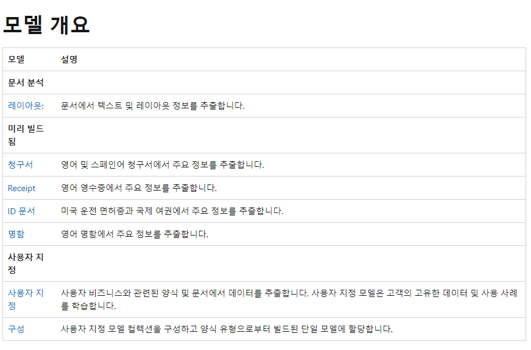

- 소개문서: https://learn.microsoft.com/en-us/azure/applied-ai-services/form-recognizer/overview?view=form-recog-2.1.0
- 가이드문서:
- [Azure Form Recognizer 레이아웃 모델](https://learn.microsoft.com/ko-kr/azure/applied-ai-services/form-recognizer/concept-layout?view=form-recog-3.0.0)
- [문서 처리 사용자 지정 모델 만들기](https://learn.microsoft.com/ko-kr/ai-builder/create-form-processing-model?toc=%2Fazure%2Fapplied-ai-services%2Fform-recognizer%2Ftoc.json&bc=%2Fazure%2Fapplied-ai-services%2Fform-recognizer%2Fbreadcrumb%2Ftoc.json&view=form-recog-3.0.0)
-
- ## 제공 기능
	- 
	- [링크](https://learn.microsoft.com/ko-kr/azure/applied-ai-services/form-recognizer/concept-model-overview?view=form-recog-2.1.0)
-