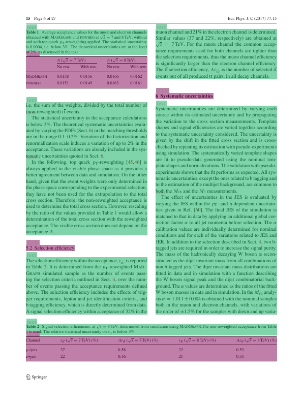

- 태그 [[OCR]]
- https://github.com/PaddlePaddle/PaddleOCR/blob/release/2.6/ppstructure/layout/README.md
-
- ## Annotation
	- 다음과 같은 정보를 포함해야 함 (paddle기준)
	- images: 이미지 정보; 파일명, w, h, id
	- annotations:
		- area, iscord, image_id, bbox, category, id
	- 예시
	- 
- ## 참고문서
	- https://github.com/PaddlePaddle/PaddleOCR/blob/release/2.6/ppstructure/kie/how_to_do_kie_en.md#12-Mainstream-Deep-learning-Solutions
	- https://github.com/PaddlePaddle/PaddleOCR/tree/release/2.6/ppstructure/kie