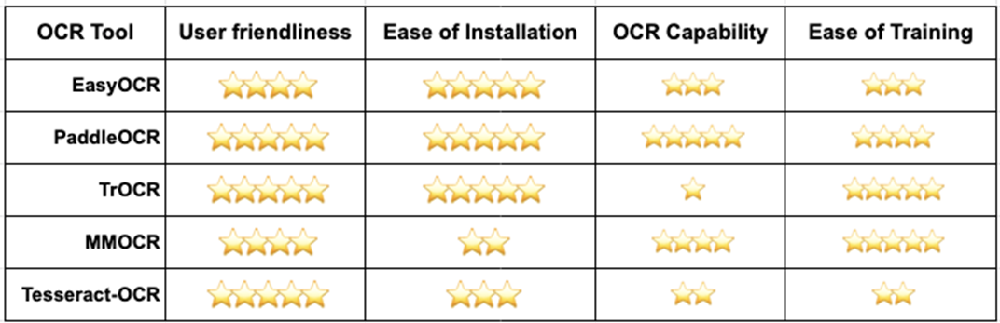

- 역할분담
	- KYH: Recogntition - 가시성☆☆☆☆☆; 시급성 ☆☆☆☆☆; 성능을 올릴 방법이 많아 보임;
	- ㄷ
	-
- ## 라이브러리
- [[EasyOCR]]
- [[PaddleOCR]]
- [[MMOCR]]
- 
	- https://towardsdatascience.com/5-open-source-tools-you-can-use-to-train-and-deploy-an-ocr-project-8f204dec862b
- # 알고리즘
- ## 과정
- [[Text Recognition]]
- [[Text Detection]]
- [[Post Processing]]
-
- ## Detection
- [[CRAFT]]
- [[DBNet]]
- ## Recognition
-
- ## Layout Analysis
-
- ## Key Information Extraction
-
- # 데이터
- ## 라벨링 가이드
	-
- ## 라벨링 툴
	- 출처: https://github.com/heartexlabs/awesome-data-labeling
	- [[labelme]]
	- [[PPOCRLabel]]
- ## 데이터 합성
	- [[SynthText]]: Detection but STR
	- [[TextRecognitionDataGenerator]]: Recognition
	- [[SynthDoG]]: VQA
-
-
-
-
- ## 학습팁
- [Paddle_자체데이터셋으로학습시킬때](https://github.com/PaddlePaddle/PaddleOCR/blob/release/2.6/doc/doc_en/training_en.md#33-build-your-own-dataset)
-