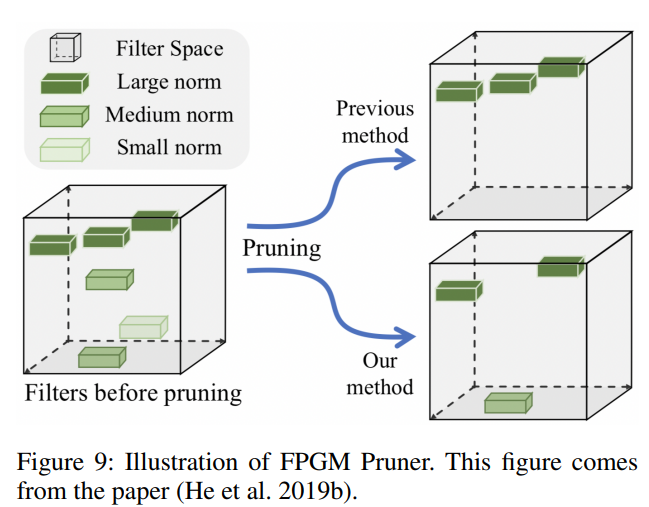

- Paper
	- 저자:
	- 날짜:
	- 상태: On
	- 주소: https://arxiv.org/abs/2009.09941
	-
	- ## Introduction
		- Practical Lightweight OCR system 개발을 위한 방법 제안
		- 1) 모델 성능 올리기
		- 2) 모델 경량화
		- 
		- #### Text Detection
			- 구조: DBNe
			- effectiveness와 efficienecy를 향상 시키기 위해 6개의 전략을 제안: light backbone, light head, remove SE module, cosine learning rate decay, learning rate warm-up, FPGM pruner
		- #### Detection Boxes Rectify
			- 검출된 text 박스를 똑바로 맞추기 위해 Classification 적용
				- 박스를 horizontal하게 만듦 => 텍스트의 방향이 거꾸로 되어있는 경우 flippling
			- 전략: light backbone, data augmentation, input resolution, PACT quantization
		- #### Text Recognition
			- 구조: CRNN
			- 9개 전략: light backbone, data augmentation, cosine larning rate decay, feature map resolution, regularization parameters, learnnig rate warm-iup, light head, pre-trained model, PACT quantization
		- #### 학습 데이터셋
			- Text Detection: 97k
			- Direction classification: 600k
			- Text Recognition: 17.9M
	- ## Related Works
		-
	- ## Methodologies
		- ### Text Detection
			- #### Light Backbone
				- backbone의 크기는 모델의 크기에 많은 영향을 끼침
				- 
				- (본인들의 PaddleClas)에 따르면 MobileNetV3이 동시간대 예측 속도에서 높은 성능을 보였음
				- 실험적으로 정확도와 효과를 밸런스 해보니 MobileNetV3_large_x0.5를 선택함
			- #### Light Head
				- 
				- text detection의 head는 FPN과 유사한데, 작은 텍스트 영역 검출에 대한 성능을 향상 시키기 위해 다양한 크기의 feature map을 fuse함
				- 이때, 다른 해상도의 feature map을 merge하기 위해 편의상 1x1 conv.를 사용해 feature map을 같은 채널 수(inner_channels for short)로 맞춤
				- probability map과 threshold map이 합쳐진 feature map으로 부터 생성되는데, inner_channels과 연관되어있음
				- 즉, inner_channels은 모델 사이즈에 지대한 영향을 줆.
				- 256 -> 96으로 inner channels을 줄임으로써 모델의 크기는 7M에서 4.1M으로 줄어듦
			- #### Remove SE
				- 
				- SE는 squeeze-and-excitation을 나타냄.
				- SE block은 채널 간의 상호 종속성(inter-dependency)을 명시적으로 모델링하고 channel-wise feature reponses를 adaptively re-calibration함
				- SE block은 vision task의 성능을 확실히 올릴 수 있기에, MobileNetV3의 search space에 포함됨
				- 그런데 입력 해상도의 크기가 클 때 (예를 들어 640x640), SE block으로 channel-wise feature response를 예측하기가 어려워지게 됨
				- 그로 인해 성능 향상은 제한되며, time-cost 또한 증가하게 됨
				- backbone에서 SE block을 제거할 때, 모델 크기는 4.1M에서 2.5M으로 줄어들고, 성능에는 영향이 없었음
			- #### Cosine Learning Rate Decay
				- {:height 549, :width 632}
				- 학습 초기에는 높은 학습률을 가져 빠르게 수렴 할 수 있게 하다가, optimal weight에 가까워지면 학습률을 상대적으로 낮추는 cosine learning rate decay적용
			- #### Learing Rate Warm-up
				- 학습 초기에, 매우 큰 learning rate를 적용하게 되면 수치적으로 불안정한 결과를 낳을 수 있기에 작은 learning rate를 사용하는 것이 추천됨
				- 그러다가 학습이 안정되면 초기 learning rate를 사용함
				- 이는 image classification에서 성능 향상을 보였으며, text detection에서도 효과가 있음을 보임
			- #### FPGM Pruner
				- {:height 515, :width 649}
				- 기존 모델에서 중요하지 않은 sub-network를 찾는 FPGM을 적용
				- FPGM은 geometric median을 조건으로 사용해 convolution layer의 각 필터가 Eucliaiean space에 있는 점이라고 간주함. 그 이후 포인트들의 geometric median을 계산하고 비슷한 값을 가진 filter를 제거함
				- 각 layer의 압축 비율은 pruning의 중요한 요소이다. 모든 layer를 균등하게 (uniformly) pruning하는 것은 상당한 성능 저하를 이끌 수 있다.
		- ### Text Direction Rectification
			- #### Light Backbone
				- MobileNetV3 사용
				- 모델 사이즈가 증가하더라도 눈에 띄는 성능 향상은 없었음
			- #### Data Augmentation
				- BDA(Base Data Augmentation) - Rotation, Perspective distortion, Motion blur, Gaussian noise 적용
				- AutoAugment, RandAugment, CutOut, RandErasing, HideAndSeek, GridMask, Mixup, Cutmix 등을 추가해 학습해봤지만, RandAugment가 가장 좋은 성능을 보임
				- 최종적으로 BDA와 RandAugment를 학습 Augmentation으로 추가
			- #### Input Resolution
				- 일반적으로 32x100으로 세팅하나, 성능 향상을 위해 48x192로 세팅
				- light backbone을 사용하기에 계산에 무리 없음
			- #### PACT Quantization (PArameterized Clipping acTivation)
				- 미리 활성함수에서 outlier를 제거하는 online quantization을 적용
				- outlier를 제거한 후 model은 더 적정한 qu
				-
				-
	- ## Experiments
	-
	- ## Results
	-