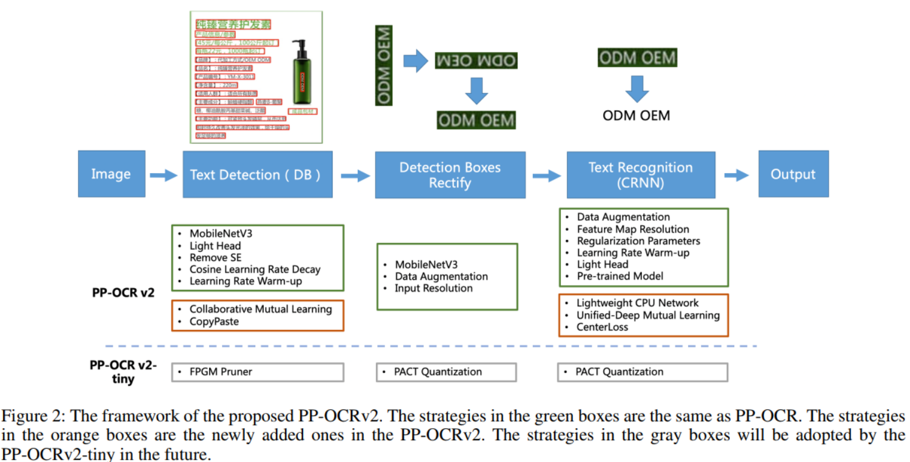
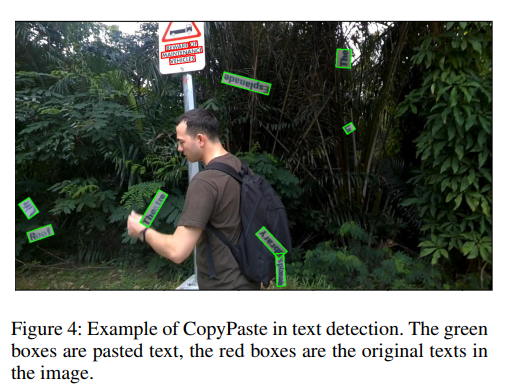
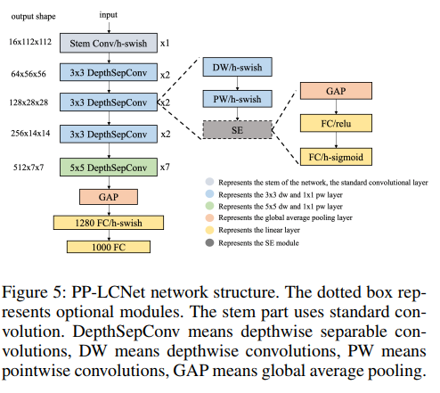
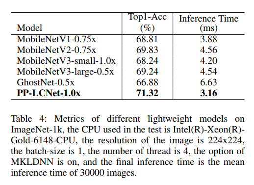

- Paper
	- 저자:
	- 날짜:
	- 상태:
	- 주소:
	- 링크: [[PP-OCR]]
	- ## Introduction
		- 기존 [[PP-OCR]]에서 더 개선
			- 같은 비용으로 정밀도(precision) 7% 개선
	- ## Related Works
		-
	- ## Methodologies
		- 
		- ### Text Detection
			- #### [[Collaborative Mutual Learning(CML)]]
				- text detection distillation 문제를 해결하고자 제안
					- 2가지 문제가 있음
					- 1) teacher 모델의 성능이 학생 성능과 가까워 지면, 일반적인 distillation 방법으로 성능을 올리는데 제한이 있다
					- 2) 만약 teacher와 student 모델의 구조가 상당히(quite) 다르다면, 일반적인 distillation 방법으로 성능을 올리는데 매우 제한이 있다
				- 목적은 sub-stduent 모델을 최적화 하는 것
			- #### CopyPaste
				- 
				- Object detection과 instance segmentation의 성능을 올려주는 augmentation trick
				- Positive와 negative 샘플의 비율을 조절하기 위해 target instance를 synthesize 하는데, image rotation, random flip, random cropping으로는 불가능 한 것을 수행함
				- 임의로 선택된 배경에 겹치지 않게 텍스트를 붙여 넣음
			- ### Text Recognition
				- #### Lightweight CPU Network (PP-LCNet)
				  collapsed:: true
					- 
					- Intel CPU 기반의 lightweight backbone으로 mkldnn enabled인 더 빠르고 더 정확한 OCR recognition 기능 제공
					- MobileNetV1을 이용
						- Intel CPU에서 MKLDNN을 사용한 세팅에서 추론 속도를 최적화하기 위해선 MobileNetV1 구조가 MobileNetV3보다 훨씬 쉬움
						- MobileNetV1의 구조를 바꿔 특징을 추출하는 기능을 향상 시킴
						- 4가지 측면에서 구조를 바꿈
							- 1) Better activation function
								- fitting 능력을 높이기 위해, 기존 ReLU에서 H-Swish로 바꿈
								- 그럼으로써 추론 속도는 조금 증가하는 데 비해 눈에 띄게 정확도는 높아짐
							- 2) [[SE]] modules at appropriate position
								- Intel CPU상에서 SE는 추론 속도를 증가시킴
								- 네트워크의 tail에 가까울수록 [[SE]]가 효율적임을 확인
								- 그래서 SE를 network의 tail 부근에 붙여 acc-speed 밸런스를 확보
								- SE의 활성화 함수를 ReLU와 H-Sigmoid로 둠
							- 3) Larger convolution kernels
								- 커널의 크기는 간혹 최종 성능에 영향을 줌
								- [[mixnet]]에서 커널 크기에 따라 네트워크 성능의 성능을 분석 함
									- 하지만 mixture는 추론 속도를 느리게 만듦
								- 최대한 속도를 조금만 증가 시키는 동시에 커널의 크기를 늘림
								- 최종적으로 네트워크 tail의 커널 크기를 5x5로 세팅
							- 4) Larger dimensional 1x1 conv layer after [[GAP]]
								- PP-LCNet에선 GAP에서 나온 출력의 차원이 작아 최종 분류 레이어에 직접 연결하면 특징 조합을 잃게 만들 수 있음
								- 강력한 fitting 능력을 주기 위해 12080 차원의 1x1 conv를 GAP layer 다음에 붙여, 추론 속도는 늘리지 않으면서 모델의 크기를 키움
							- 
					-
				- #### [[Unified-Deep Mutual Learning]] (U-DML)
					-
	- ## Experiments
		-
	- ## Results
		-