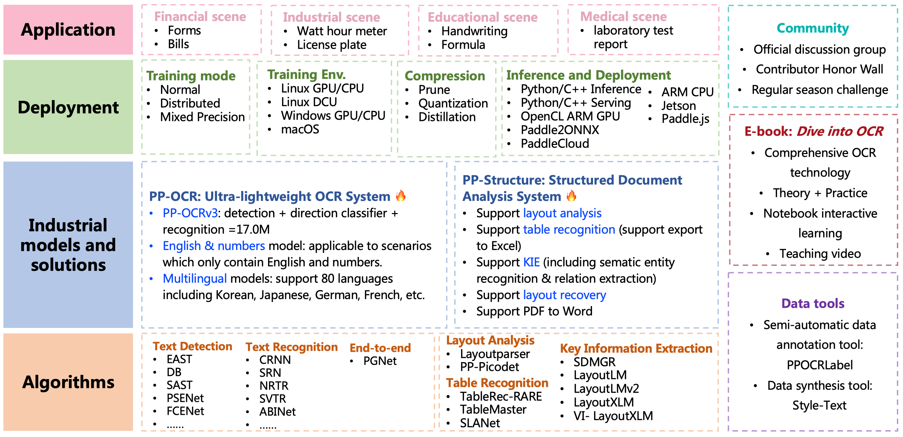

- 링크: https://github.com/PaddlePaddle/PaddleOCR
-
- 
- ## 설치방법
- 1. pip 이용하기
	- (1) ``pip install paddle paddleocr``
- 2. git 이용하기
	- (1) ``git clone https://github.com/PaddlePaddle/PaddleOCR``
	-
-
- ## 문서 정리
- [Text Detection Training](https://github.com/PaddlePaddle/PaddleOCR/blob/release/2.6/doc/doc_en/detection_en.md)
- [[Backbone 관련 문서]]
- [[Layout Analysis]]
-