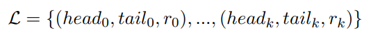

- Equipped with the document D and the semantic entity label set C, relation extraction aims to predict the relation between any two predicted semantic entities. Defining R = {r0, r1, .., rm} as the semantic relation labels, we intend to find a function FRE : (D, C, R, E) → L, where L is the predicted semantic relation set:
  
  where headi and taili are two semantic entities. In this work, we mainly focus on the key-value relation extraction.