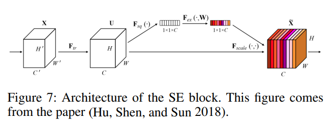

- {:height 248, :width 655}
- SE는 squeeze-and-excitation을 나타냄.
- SE block은 채널 간의 상호 종속성(inter-dependency)을 명시적으로 모델링하고 channel-wise feature reponses를 adaptively re-calibration함
- SE block은 vision task의 성능을 확실히 올릴 수 있기에, MobileNetV3의 search space에 포함됨