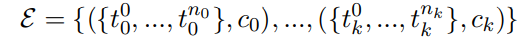

- Given a visually rich document D, we acquire discrete token set t = {t0, t1, ..., tn}, where each token
  ti = (w,(x0, y0, x1, y1)) consists of a word w and its bounding box coordinates (x0, y0, x1, y1).
  C = {c0, c1, .., cm} is the semantic entity labels
  where the tokens are classified into. Semantic entity recognition is the task of extracting semantic entities and classifying them into given entity
  types. In other words, we intend to find a function FSER : (D, C) → E, where E is the predicted
  semantic entity set:
  
-