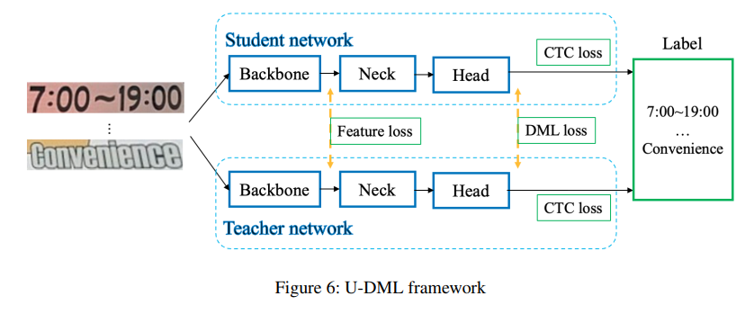

- # Unified-Deep Mutual Learning (U-DML)
	- 
	- [[Deep Mutual Learning]]과 [[OverHaul]]의 짬뽕
	- Distillation 과정간 feature map도 고려
	-
	- Teacher 와 student network의 구조는 완벽히 똑같으나 초기 가중치는 다름 (scratch학습 수행)
	- 목표는 같은 입력 이미지에 대해, 2개의 네트워크가 예측결과와 feature map에 대해 같은 출력을 만드는 것
	- Loss
		- 3개로 이뤄짐
		- 1) CTC loss
			- $$Loss_{ctc}=CTC(S_{hout}, gt)+CTC(T_{hout}, gt)$$
			- .$$S_{hout}$$은 student의 head output, $$T_{hout}$$은 teacher의 head output
		- 2) DML loss
			- $$Loss_{dml}=\frac{KL(S_{pout}||T_{pout})+KL(T_{pout}||S_{pout})}{2}$$
			- 기존 DML에선 각 네트워크 파라미터가 각자 업데이트 되었으나, 동시에 업데이트 되도록 수정
			- .$$S_{pout}=Softmax(S_{hout})$$, $$T_{pout}=Softmax(T_{hout})$$
		- 3) Feature loss
			- $$Loss_{feat}=L2(S_{bout},T_{bout})$$
			- .$$S_{bout}$$: student network의 backone 출력
			- .$$T_{bout}$$: teacher network의 backone 출력
		- $$Loss_{total}=Loss_{ctc}+Loss_{dml}+Loss_{feat}$$
	- Piece-wise learning rate strategy가 더 나음을 확인
	- 추가적으로 CTC-head에 하나의 FC layer만 있는 것을 2개가 되도록 바꿈 (정확도 1.5% 증가)
-