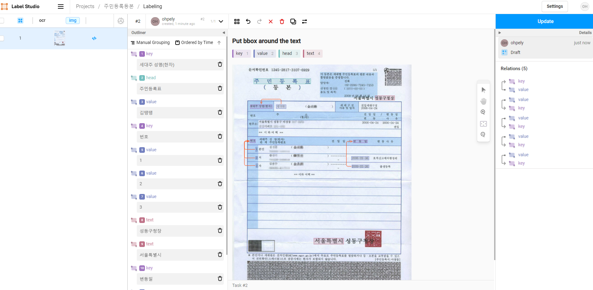

- 주소: https://github.com/heartexlabs/label-studio
- tags: [[Text Detection]] [[Text Recognition]]
-
- ## [제공 기능](https://github.com/heartexlabs/label-studio#what-you-get-from-label-studio)
	- Multi-user labeling
	- Multiple projects
	- Streamlined design
	- Configurable label formats
	- Support for multiple data types
-
-
- ## 사용 예시
	- https://github.com/heartexlabs/label-studio#what-is-label-studio
	- 
-
-
- ## OCR용으로 사용시 참고
	- https://github.com/heartexlabs/label-studio/issues/142
-