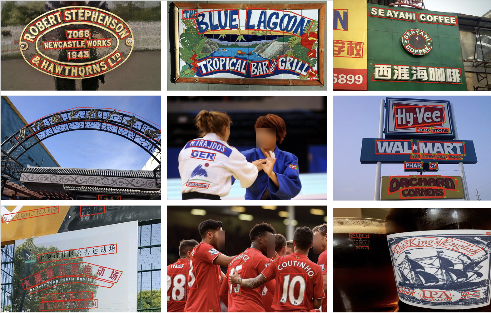
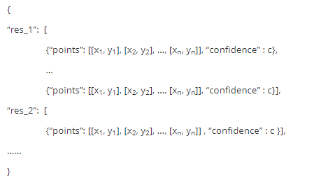
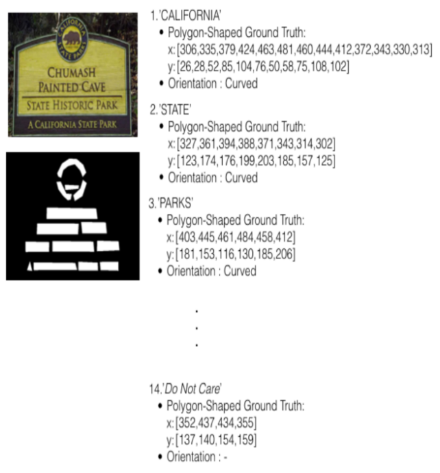
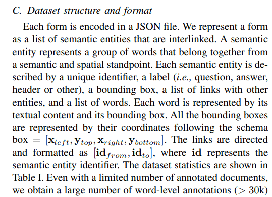
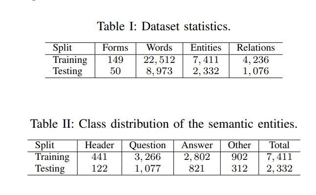
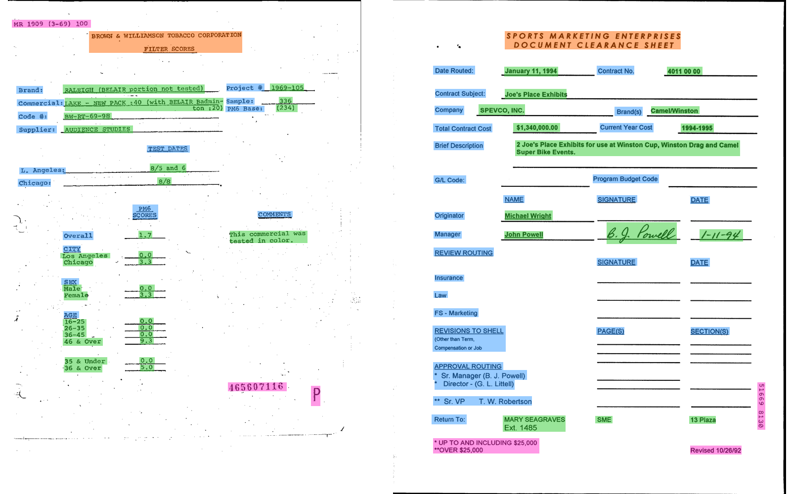
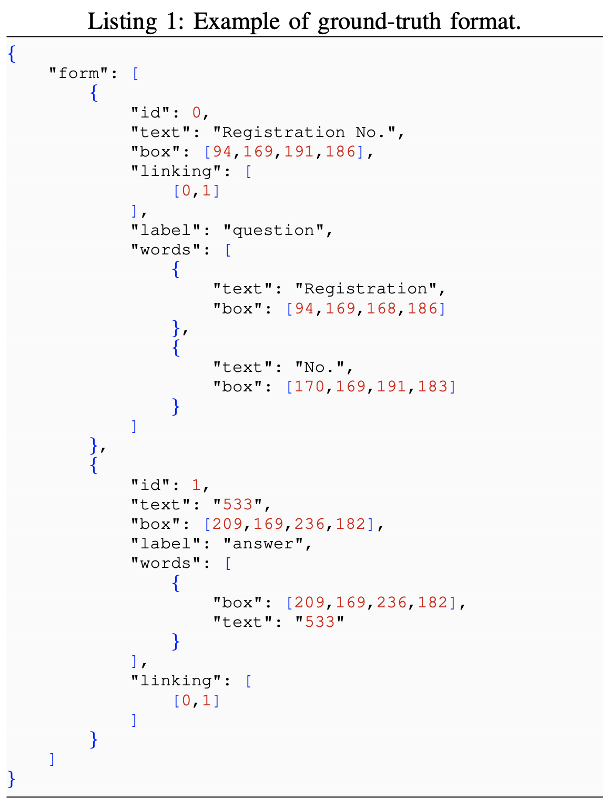

- [ICDAR](https://rrc.cvc.uab.es/?ch=14)
	- Karatzas, et al., 2013, 2015
	- Gomez, et al. 2017
	- C. Chng, et al. 2019
		- Task: Scene Text Detection, Scene Text Recognition
		- 
		- 
	-
- [Total-Text](https://github.com/cs-chan/Total-Text-Dataset), [Format](https://github.com/cs-chan/Total-Text-Dataset/tree/master/Groundtruth/Text)
	- task: word-level based English curve **Detection**, **Recogntition**
	- Ch’ng and Chan, 2017
	- 
- [CTW1500](https://github.com/Yuliang-Liu/Curve-Text-Detector)
	- Yuliang et al., 2017
- [SynthText](https://www.robots.ox.ac.uk/~vgg/data/scenetext/)
	- Gupta et al., 2016
- [FUNSD](https://guillaumejaume.github.io/FUNSD/). [논문](https://arxiv.org/abs/1905.13538)
	- task: Text Detection, Text Recognition, Spatial Layout Analysis, Form Understanding
	- Jaume et al., 2019
	- 관련: [링크1](https://www.arxiv-vanity.com/papers/2010.05322/), [링크2](https://www.kaggle.com/code/lonelvino/funsd-analyse-dataset)
	-
	- 
	- 
	- 
	- 
- ICDAR 2019 Robust Reading Challenge on Scanned Receipts OCR and Information Extraction (SROIE)
- 출처: https://arxiv.org/pdf/2011.13534.pdf
-
- ## 기타
	- https://cneud.github.io/ocr-gt/