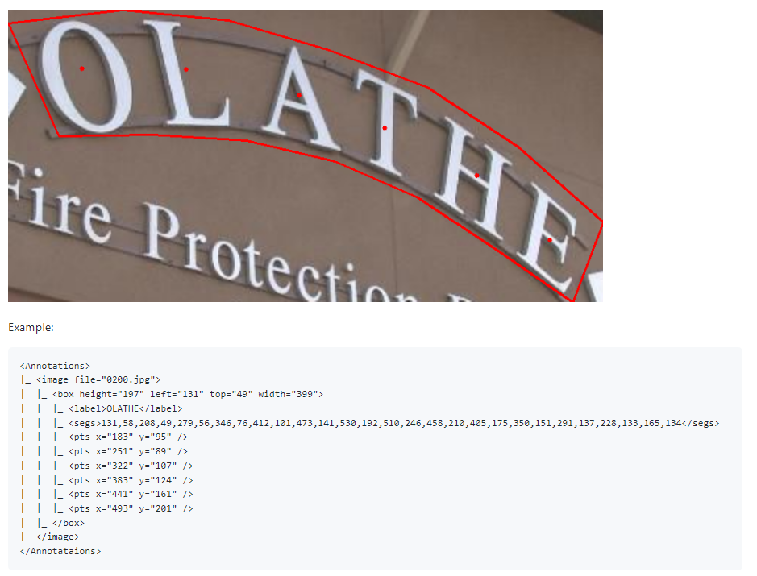

- (TD, TR)[ ICDAR](https://rrc.cvc.uab.es/?ch=14)
  collapsed:: true
	- Karatzas, et al., 2013, 2015
	- Gomez, et al. 2017
	- C. Chng, et al. 2019
	  collapsed:: true
		- Task: Scene **Text Detection**, **Text Recognition**
		- 
		- 
	-
- (TD, TR) [Total-Text](https://github.com/cs-chan/Total-Text-Dataset), [Format](https://github.com/cs-chan/Total-Text-Dataset/tree/master/Groundtruth/Text)
  collapsed:: true
	- task: word-level based English curve **Detection**, **Recogntition**
	- Ch’ng and Chan, 2017
	- 
- (TD) [CTW1500](https://github.com/Yuliang-Liu/Curve-Text-Detector)
	- Yuliang et al., 2017
	- annotation: point, text
	- 
- (TR) [SynthText](https://www.robots.ox.ac.uk/~vgg/data/scenetext/)
  collapsed:: true
	- Gupta et al., 2016
- (TD,TR,LA,FU) [FUNSD](https://guillaumejaume.github.io/FUNSD/). [논문](https://arxiv.org/abs/1905.13538)
  collapsed:: true
	- Jaume et al., 2019
	- 관련: [링크1](https://www.arxiv-vanity.com/papers/2010.05322/), [링크2](https://www.kaggle.com/code/lonelvino/funsd-analyse-dataset), [Key Information Extraction dataset](https://github.com/PaddlePaddle/PaddleOCR/blob/release/2.6/doc/doc_en/dataset/kie_datasets_en.md)
	- 
	- 
	- 
	- 
- (FU) [XFUND](https://github.com/doc-analysis/XFUND)
- ICDAR 2019 Robust Reading Challenge on Scanned Receipts OCR and Information Extraction (SROIE)
- 출처: https://arxiv.org/pdf/2011.13534.pdf
-
- ## 기타
	- https://cneud.github.io/ocr-gt/
	- [Document AI (Microsoft Research Asia)](https://github.com/doc-analysis)
	-